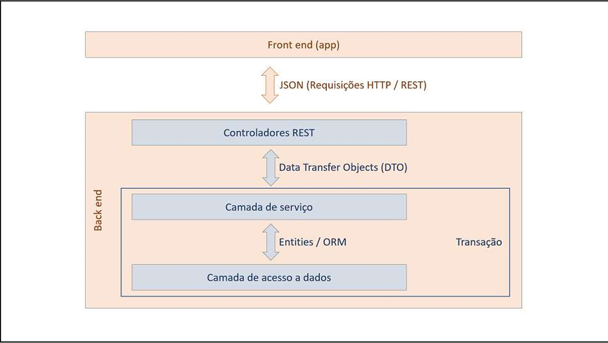

# IntraList

O **IntraList** é um sistema empresarial desenvolvido como projeto de conclusão de curso no curso de Análise e Desenvolvimento de Sistemas. O objetivo principal do sistema é fornecer uma ferramenta eficiente de gerenciamento de projetos e tarefas dentro de equipes empresariais, com funcionalidades modernas e uma interface amigável.

## Objetivos do Projeto

- Facilitar o gerenciamento de tarefas e equipes em um ambiente corporativo.
- Proporcionar uma visão clara do andamento dos projetos.
- Registrar atividades e informações de maneira organizada e acessível.

## Tecnologias Utilizadas

### **Back-End:**
- **Linguagem:** Java 17
- **Framework:** Spring Boot 3.4.1
  - **Spring Web:** Para construção de APIs RESTful.
  - **Spring Data JPA:** Para interação com o banco de dados usando ORM.
- **Banco de Dados:**
  - **H2 Database:** Para testes locais.
  - **PostgreSQL:** Banco de dados definitivo em produção.

### **Ferramentas e IDE:**
- **IDE:** IntelliJ IDEA
- **Controle de Versão:** Git + GitHub
- **Gerenciador de Dependências:** Maven

## Arquitetura do Sistema

O sistema foi desenvolvido utilizando a arquitetura **Camadas**, que separa claramente as responsabilidades em:


## Modelo de Dominio


## Como Executar o Projeto

1. **Pré-requisitos:**
   - Java 17 ou superior instalado.
   - Maven configurado no ambiente.
   - PostgreSQL configurado (para o ambiente de produção).

2. **Clonar o Repositório:**
   ```bash
   https://github.com/HandersonBarreto/intralist.git
   ```

3. **Configurar o Banco de Dados:**
Inserir futuramente

4. **Executar o Projeto Localmente:**
Inserir futuramente

5. **Acessar os Endpoints:**
Inserir futuramente

## Estrutura Inicial do Projeto

Inserir futuramente

## Cronograma de Desenvolvimento

| Fase                  | Período       | Atividades Principais                                  |
|-----------------------|---------------|------------------------------------------------------|
        |

## Próximos Passos

1. Criar as entidades principais (`Funcionario`, `Projeto`, `Tarefa`, etc.).
2. Implementar os repositórios e serviços correspondentes.
3. Configurar os endpoints REST no Controller.
4. Realizar testes com Postman.
5. Integrar o sistema com o banco de dados PostgreSQL.

## Contribuições

Inserir futuramente

## Licença

Inserir futuramente

---

**IntraList** - Tornando o gerenciamento de tarefas mais simples e eficiente!
